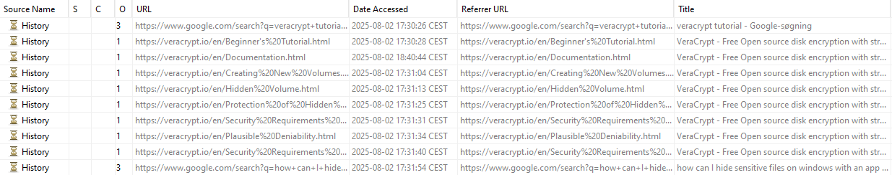

# VeryCheap

Writeup by KristianLibo (0-Day Aarhus)

> In 2025, a new bakery chain called VeryCheap has taken Denmark by storm, selling their brunsviger at suspiciously low prices and driving independent bakeries out of business.
> But behind the sugary facade, something doesn't add up. They must be losing money with such low prices - and why are so many of their customers in suits?
> 
> A recent police raid seized one of their office PCs. Your task: perform a full forensic analysis of the disk and find what VeryCheap is really hiding!
> 
> Difficulty: Hard, Author: Nissen, Category: Forensics

This forensics task revolves around a disk dump. For seasoned forensics players, the title might bring similarity to VeraCrypt, a well-known program for encrypting disk volumes inside files. As we later reveal, this is a correct assumption but not needed as the usage of VeraCrypt was very visible.

## Initial analysis - Autopsy

For a quick mostly automated analysis, the disk dump can be loaded into Autopsy to see if there are any initial leads to go from:

We quickly notice that two files are in the Recycle Bin, one being an installer for the latest version of VeraCrypt and another being a note mentioning that some test container's password is "brunsviger". Clearly our target has been trying out VeraCrypt and is now done with their experiments.

As of now we could go to try find the test container, however, depending on how it was made this container might be hard to find. Although VeraCrypt's default file extension is .hc, in reality it could be any file extension and VeraCrypt volumes do not use a recognizable header we can scan after. We can try to find files where the header mismatches the extension or files with high entropy, both things that Autopsy should be able to do when given enough ingest time with its plugins as high entropy files are noted as potentially encrypted. However, if we'd rather not wait for Autopsy (or encountered a crash like I did due to a faulty VM setup), we can dive into the disk more manually. 

Before we do that, we check the activities noted by Autopsy, specifically we can see the target has a lot of web activities logged. This web history reveals multiple searches on how to hide data as well as guidance on the use of VeraCrypt. Amongst the most important takeaways from the web history we have searches on VeraCrypt's hidden volumes feature, plausible deniability, keyfiles, and Command-line usage of Veracrypt. 

To finish up our Autopsy use, we can also look into the recently used files tab of Autopsy as it has a long list of activities recorded. Most importantly, it shows clear sign of VeraCrypt usage due to other drive letters (X and Z) being used as locations. While we cannot see the contents of the files, we note that some of them appear to be decoy files, likely our target is trying hide something in a hidden volume while filling the first volume with the decoys. This will be important to keep in mind as we proceed. 

## Extracting artifacts - FTK Imager

### The test container

Due to aforementioned issue with my Autopsy setup, I quickly loaded up the disk in FTK Imager. FTK Imager is another classic forensics tool and allows for a simple and quick tree overview of any files in the disk's partitions. Taking a quick look around the personal user "Joe" folders (Desktop, Documents, Pictures, Music, and Videos), reveals a file called "test.hc" in the target's documents folder as well as a bunch of pictures of Brunnere in the Pictures folder. As ".hc" is basically only used by VeraCrypt and we already know a password for a test container, we extract the file and open it as a volume using VeraCrypt. It unlocks and reveals a note:

> Just a test, need to know how VeraCrypt works for... things.
> I would never actually leave a sensitive container in the clear, and definitely wouldn't leave the password laying around... I hope.

While this does sound reasonable, if a container holds a hidden volume, it would unlock a different set of files by the use of another password so we should keep the test container in mind if we find other potential passwords.

### Console history

An interesting aspect earlier was the command-line use of VeraCrypt, there is a chance we can find some history on the use of VeraCrypt within the target's PowerShell logs. For any non-seasoned forensics player, this would be a good time to search on Google where console history is saved on Windows 10 (or consult your favorite LLM), but it's a classic artifact to look for, so off to the path of "C:\Users\Joe\AppData\Roaming\Microsoft\Windows\PowerShell\PSReadLine\ConsoleHost_history.txt" we go. Amongst a few lines of changing directories using "cd" we find the following two commands:

> & 'C:\Program Files\VeraCrypt\VeraCrypt.exe' /v 'C:\Program Files\7-Zip\7z.dll' /p "VeryCheapAndDeliciousBrunnerForAll" /k ".\Pictures\VeryCheapBrunner.png" /l X /m rm /a /q
> 
> & 'C:\Program Files\VeraCrypt\VeraCrypt.exe' /u x /q /a

We can see that VeraCrypt was used to mount the file "C:\Program Files\7-Zip\7z.dll" as a volume, using the password "VeryCheapAndDeliciousBrunnerForAll" with a keyfile of ".\Pictures\VeryCheapBrunner.png" as well. Later the volume was unmounted. This certainly fits with our target's desire to hide their activities in a relatively random file, after all, who would usually go to check "7z.dll" in the program files? We quickly unlock the volume in Veracrypt using these parameters and are met with the sight of a note, a recipe using a large amount of Sesame Oil in a brunsviger (which sounds truly horrifying), and a budget that is rather plain. The note goes as follows:

> \# VeryCheap Brunsviger
> 
> Attached recipe is the very real and not at all decoy super secret recipe for our famous brunsviger.
This made us rich, really hope nobody finds this and sells our delicious non-disgusting brunner!
> 
> \#\# Flag
> 
> Flag? Not sure what you're talking about, this is just a delicious brunner recipe.
> Maybe your flag is in another castle? Or maybe the same?
> Who knows, some castles might have a back entrance with a different key, hmm.
> I honestly can't remember... well anything really, that's why I keep so many sticky notes around...
> Also they remind me of the sticky brunsviger topping - mmm, brunsviger :P
> 
> Enjoy the brunner!

So, this is the decoy volume we considered earlier. Yet, what is the password for the hidden volume? The note contains a clue - "sticky notes", a common place for less privacy-focused people to keep passwords and other things that really should not be laying around in plain text.

### Chasing notes and a hidden volume

We should go look at what is in Sticky Notes after the previous note. Sticky Notes are stored in a database located at "C:\Users\Joe\AppData\Local\Packages\Microsoft.MicrosoftStickyNotes_8wekyb3d8bbwe\LocalState". In there we find plum.sqlite, the database we are looking for, as well as two other database-related files - plum.sqlite-shm and plum.sqlite-wal. The database can be opened using DB browser for SQLite but in this scenario we should remember to place both the Write-Ahead Log (WAL file) and the SHM file in the same folder when opening as not all operations have been applied to the main database when those files are non-empty. We could miss important operations on the database if we do not take them along.
 
> Remember: NEVER save anything sensitive as a file on disk, just keep it in an unsaved Notepad window.
> No worries, can be closed, Notepad remembers it when reopening.

The sticky notes lead us towards Windows' built-in Notepad. Luckily, on Windows 10+, Notepad stores it's state in plaintext so we can directly access the notetext from the files in "C:\Users\Joe\AppData\Local\Packages\Microsoft.WindowsNotepad_8wekyb3d8bbwe\LocalState\TabState". Checking through the files there gives us the password "WhaaaatItCanHaveAnExtraHiddenVolume?!?" which can be used to unlock a hidden volume in "7z.dll". In there we find an image of the VeryCheap CEO as well as the full budget of the company. 

The budget has a bunch of notes about the stores selling Brunnere at a loss as a cover for weapon smuggling and other crimes but it also contains our flag!